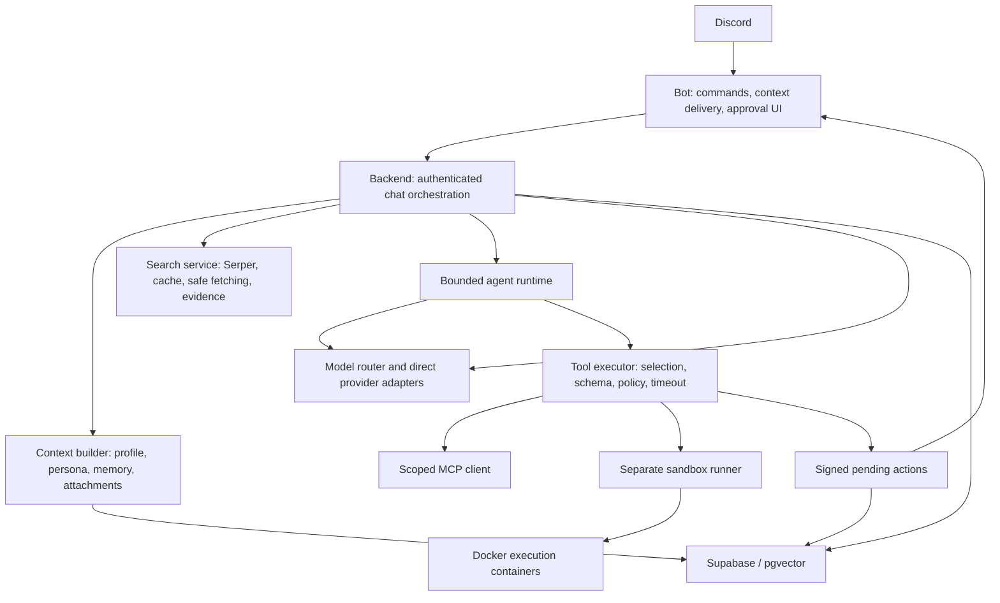

# Zauq v4 architecture

## Ownership

`bot/client.py` handles Discord events, recent/reply context, attachment transfer and delivery. Slash command cogs use the shared authenticated API-client factory. The backend is the authority for available tools and execution policy; the bot does not maintain a separate MCP registry.

`backend/chat/context_builder.py` resolves mode/model preferences, retrieves optional memory/lore and parses attachments. `backend/chat/orchestrator.py` owns automatic/explicit/category/deep retrieval, dispatch, transparent fallback, file extraction, redaction and request accounting. Both normal chat and buffered HTTP streaming use this path.

`backend/models/router.py` dispatches direct generation, native streaming and native agent turns. Provider adapters translate tool declarations and preserve their own native continuation state: Gemini thought signatures and function IDs, Claude signed thinking blocks, and compatible reasoning/tool messages. Media preprocessing is tracked per provider/model to avoid repeated work between tool turns.

`backend/agent/capability_router.py` chooses a small relevant tool set from the original request. Retrieved content cannot grant tools. Non-tool models use direct generation with deterministic retrieval. `backend/agent/runtime.py` manages budgets, calls, observations, duplicate detection, one optional code repair and final synthesis. A failure after tools returns an incomplete result instead of restarting tool execution under a fallback model.

`backend/tools/` owns specs, aliases, registration, JSON Schema validation and policy. Execution independently enforces the selected set, risk, guild scope, automatic mode and channel permission. Tool output is sanitized, capped and fenced before returning to a model.

`backend/search/` owns Serper queries, bounded cache, public fetches, evidence and attribution. Direct HTTP pins the resolved public IP while preserving Host and TLS SNI; redirects are revalidated and bytes are capped before text parsing. Jina is a separate external page-reading service. Standard chat does not use native Gemini grounding.

`backend/mcp_client/` owns trusted operator configuration, connections, discovery, heartbeat and bounded reconnect attempts. Each connection has one owner task, keeping SDK/AnyIO scope creation and teardown in the same task. Configured HTTP headers are supplied to the actual transport. Newly discovered tools need explicit local grants and risk classification.

`backend/actions/` owns signed immutable previews, expiry, authorization and conditional lifecycle transitions. Supabase errors block durable action execution; offline-created actions use a bounded local store. The execution claim precedes dispatch, providing at-most-once attempts rather than transactional exactly-once guarantees for remote side effects.

`backend/sandbox/` owns the execution semaphore, subprocess pipes and Docker cleanup. Only the runner has Docker access in Compose. Code moves through an explicit shared daemon-host spool, is mounted read-only and runs under a non-root UID with networking/capabilities disabled and CPU/memory/PID/time/output limits. The runner itself remains a trusted privileged component.

## Resolution and rollout

Model priority is channel override → guild default → Gemini system default. Mode priority is request override → channel override → guild default → Hangout. A request persona override does not grant code execution. Explicit `allow_code_exec=false` wins; auto mode is a separate saved preference.

Agent/MCP access requires the master flag and operator allowlists. A nullable channel preference overrides a nullable guild preference; absent preferences inherit the enabled master state. MCP server guild scope is an additional execution barrier. Configured step caps are bounded by eight regardless of model output.

## Observability and persistence

Request metrics contain IDs, provider/model, tier, latency, tool counters, known tokens, per-provider physical usage and optional estimated model cost. Durable SQL aggregation reads all retained database logs; fallback aggregation explicitly covers the last 1,000 process-local requests. Missing usage/pricing is represented as unknown. Background memory extraction, embeddings and non-model services are separate costs.

[DEPLOYMENT.md](DEPLOYMENT.md) defines release checks. See [PRIVACY.md](PRIVACY.md) for data flows and deletion scope.
