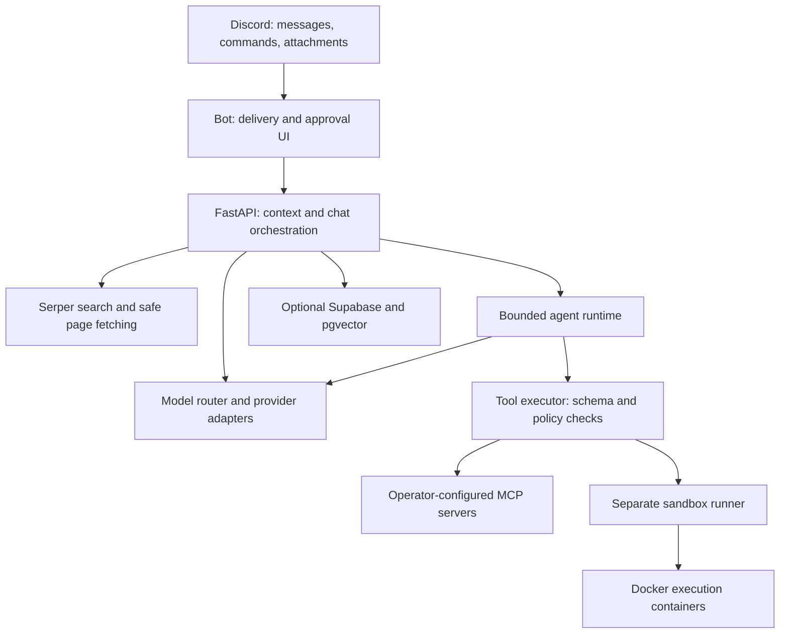

<div align="center">


# Zauq (ذوق) v4

An MCP-powered agentic AI assistant for Discord with web research, coding tools, sandboxed execution, semantic memory, multi-provider LLM routing, and extensible tool use.

[](#quick-start)
[](backend/main.py)
[](bot/client.py)
[](LICENSE)

Selectable models · Bounded agents · Web research · Docker sandbox · Scoped MCP

Created by **Syed Muhammad Hassan / AgenticEra Systems**. [Apache 2.0](LICENSE).

</div>

<div align="center">
    
[Features](#features) · [Architecture](#architecture) · [Models](#models-and-provider-routing) · [Quick start](#quick-start) · [Commands](#commands-and-examples) · [Deployment](DEPLOYMENT.md) · [Documentation](#documentation)

</div>

## Overview

**Zauq (ذوق)** brings conversational AI and practical tools into Discord. Members can ask questions through mentions, replies, DMs or threads, attach documents and media, research current information, generate files and run permitted code snippets. Operators choose model providers, server preferences and the tools available to each community.

v4 introduces a bounded agent runtime: a supported model can request selected tools, inspect their results and produce an answer within enforced budgets. Web research uses Serper, code runs through a separate Docker runner, and external integrations use operator-configured MCP servers. Mutating tools require signed, expiring approval before execution.

The project keeps the existing memory, lore, moderation, voice, media, XP and reminder features. Its deployment separates the Discord client, FastAPI backend and sandbox runner, without requiring Redis, Celery, a browser runtime or a local model. **Agent and MCP master flags default to off**, allowing operators to introduce them gradually.

## Features

| Area | Shipped behavior |
| --- | --- |
| Chat | Mentions, replies, DMs and thread conversations; Dev and Hangout personas |
| Models | Direct Gemini, Claude, Qwen, DeepSeek and DigitalOcean clients; optional Ollama and Kaggle workers |
| Research | Serper search with six categories; public-page fetching; bounded multi-query deep research |
| Agent | Selected tools only, validated JSON arguments, resource budgets, duplicate-call detection and total deadlines |
| Sandbox | Python, JavaScript and Bash; separate runner; no network in execution containers; explicit channel permissions |
| MCP | Operator-configured stdio and Streamable HTTP servers; explicit tool grants, risk classifications and guild scope |
| Approvals | Signed, expiring previews; initiating user or Discord administrator approval; atomic single-use execution claim |
| Memory | Optional Supabase episodic facts and lore retrieval, with embeddings and decay |
| Community | XP/rank, reminders, moderation, trivia, summarization, exports, memes, images and TTS |

Thinking, images, audio and native tool support depend on the selected model **and** its transport. Unsupported media may use Gemini OCR or audio transcription, so a local text model does not guarantee entirely local processing. Provider fallback is disclosed in response metadata. Model autocomplete is a suggestion list, not an account availability probe.

### Conversation, memory and files

Dev and Hangout personas support technical and conversational use. Channel preferences inherit server defaults; optional Supabase storage adds episodic user facts, embeddings and server lore retrieval. Documents, images and voice notes can contribute context, and file-generation commands return sanitized downloads. Parsing and context size are bounded, so document ingestion is not guaranteed to be lossless.

### Research and code verification

Quick and deep research share one retrieval service, with category filters, bounded page fetching and source attribution. Failed pages are labeled as search snippets. Python, JavaScript and Bash snippets run in execution containers with networking disabled, resource limits and read-only code mounts. Automatic testing supports `off`, `auto` and `always`, independently of channel execution permission.

### External tools with reviewable actions

MCP supports stdio and Streamable HTTP. Operators configure servers, tool grants, risk classifications and guild access; chat users cannot install arbitrary servers. Write/destructive calls produce an argument preview with **Approve** and **Deny** buttons. Single-use claims prevent repeated clicks from starting the same action twice.

### Community operations and observability

The command suite includes moderation, XP/rank, reminders, trivia, exports, summarization, TTS, images and memes. `/stats` reports provider volume, latency, tool counters, reported token usage and optional model-cost estimates. Durable metrics survive process restarts when Supabase is configured; the local fallback identifies its limited reporting window.

## Architecture



The backend resolves profiles and context, performs requested retrieval, then uses direct generation or the agent runtime according to the model and effective rollout settings. The executor validates tool arguments and permissions before dispatch. Mutating tools are staged for approval; approved execution rechecks current policy.

Only the runner receives Docker access in Compose. It transfers code through an explicit shared daemon-host spool. Component ownership, native provider continuation and policy resolution are documented in [ARCHITECTURE.md](ARCHITECTURE.md).

## Models and provider routing

| Tier | Provider IDs | Configuration |
| --- | --- | --- |
| **1 — Cloud APIs** | `gemini`, `digitalocean`, `anthropic`, `qwen`, `deepseek` | Credentials for the selected provider; Qwen also needs its regional/workspace endpoint |
| **2 — Local model server** | `ollama` | A reachable Ollama endpoint and an installed model |
| **3 — GPU worker** | `kaggle` | A reachable configured worker/tunnel |

Selection follows **channel override → server default → system default**. `/model set` changes the channel or server selection; `/model status` explains the effective choice. The provider catalog is centralized in [backend/models/catalog.py](backend/models/catalog.py), with model-specific behavior in [capabilities.py](backend/models/capabilities.py).

Native tools, thinking and media support vary by model. Models without native tools retain direct generation and deterministic retrieval. Custom model IDs receive basic format validation; the provider checks actual account availability when called. See [model guidance](USER_GUIDE.md#model-and-mode-controls) for lifecycle caveats and fallback behavior.

## Quick start

### 1. Prepare the environment

Use Python **3.11 or 3.12**, Git and a virtual environment. Basic Discord chat needs a bot token, an internal API key and access to a configured model provider. Supabase adds persistent profiles/memory; Serper adds search; Docker and the separate runner add code execution.

```bash
git clone https://github.com/Muhammad-Hassan12/Zauq.git
cd Zauq
python3 -m venv venv
. venv/bin/activate
pip install -r requirements.txt
cp .env.example .env
```

### 2. Configure credentials

Generate an internal service key:

```bash
openssl rand -hex 32
```

Set `INTERNAL_API_KEY` to that value in `.env`, add `DISCORD_BOT_TOKEN`, and configure the credentials/endpoint for your chosen provider. Gemini is the system default; another provider can be selected through the model controls after persistent settings are configured. Optional credentials may remain blank.

For persistent profiles, memory, approvals and metrics, configure Supabase using the fresh schema or ordered upgrades in [DEPLOYMENT.md](DEPLOYMENT.md#database-setup). Use the backend service-role key. Keep `.env` and the operator MCP config out of version control.

### 3. Configure Discord

Create/configure your bot in the Discord Developer Portal, enable the **Message Content Intent**, and invite it with the `bot` and `applications.commands` scopes. Grant permissions for the features you enable, such as reading/sending messages, attaching files, moderation or voice access. The client requests message-content access for conversational behavior.

The bot syncs application commands on startup. The owner-only `!sync` command can refresh registration when needed.

### 4. Start the services

Run the backend and bot in separate terminals, with the virtual environment active in each:

```bash
# Terminal 1
python -m uvicorn backend.main:app --host 127.0.0.1 --port 8002
```

```bash
# Terminal 2
python -m bot.client
```

Check backend liveness, then use `/info` and `/model status` in Discord:

```bash
curl --fail http://127.0.0.1:8002/health
```

Mention the bot or reply to one of its messages to begin a conversation. A successful health check confirms backend liveness; the Discord/model checks exercise more of the configured setup.

### 5. Add optional execution and deployment

For local sandbox execution, run the separate runner under a Docker-capable identity and set `SANDBOX_RUNNER_URL=http://127.0.0.1:8001`. The backend process should not need Docker privileges. Execution images must be pre-pulled; requests never pull them automatically.

For Docker Compose or supervised VPS processes, follow [DEPLOYMENT.md](DEPLOYMENT.md). Compose supplies the shared host spool, matching service keys and service addresses; it publishes the backend on loopback and keeps the runner inside its network. Enable agent/MCP tools first in a restricted test channel using the documented rollout procedure.

## Configuration

The complete template is [.env.example](.env.example). Important settings are:

| Setting | Purpose |
| --- | --- |
| `DISCORD_BOT_TOKEN` | Discord client authentication |
| `INTERNAL_API_KEY` | Shared bot/backend/runner authentication and pending-action signing |
| `GEMINI_API_KEY`, `DO_MODEL_ACCESS_KEY`, `ANTHROPIC_API_KEY`, `QWEN_API_KEY`, `DEEPSEEK_API_KEY` | Configure the providers you use |
| `SUPABASE_URL`, `SUPABASE_KEY` | Persistent profiles, memory, approvals and telemetry |
| `SERPER_API_KEY` | Search credentials; Serper is the implemented search provider |
| `AGENT_RUNTIME_ENABLED`, `MCP_ENABLED` | Master switches; both default to `false` |
| `AGENT_ALLOWED_GUILD_IDS`, `AGENT_ALLOWED_CHANNEL_IDS` | Operator restrictions on agent rollout |
| `MCP_ALLOWED_GUILD_IDS`, `MCP_ALLOWED_CHANNEL_IDS` | Operator restrictions on MCP rollout; server tool scopes also apply |
| `SANDBOX_RUNNER_URL` | Separate execution service endpoint |
| `AUTO_CODE_TEST_DEFAULT` | Default auto-test policy: `off`, `auto` or `always` |
| `MODEL_PRICING_JSON` | Optional per-provider/model input and output rates for cost estimates |

Saved channel/server preferences cannot bypass a disabled master flag or operator allowlist. MCP server scope and tool grants add further restrictions. See [scoped rollout](DEPLOYMENT.md#scoped-rollout) and the disabled templates in [config/mcp_servers.example.json](config/mcp_servers.example.json).

For an isolated local backend experiment, `DEVELOPMENT_MODE=true` explicitly permits a blank internal key. Keep development bypass off for deployment; production startup requires a key.

## Commands and examples

| Command family | Purpose |
| --- | --- |
| `/info`, `/model status`, `/model set`, `/model reset` | Inspect the engine and choose channel/server models |
| `/mode`, `/mode_reset`, `/thinking` | Set persona and supported native-reasoning preferences |
| `/search` | Quick/deep research with `all`, `github`, `arxiv`, `docs`, `wikipedia` or `news` categories |
| `/run`, `/sandbox status`, `/sandbox auto_mode` | Manual execution and automatic testing policy |
| `/agent status`, `/agent tools`, `/agent enable` | Runtime status, registry and scoped preference |
| `/mcp status`, `/mcp tools` | External server health and guild-visible tools |
| `/file generate`, `/create_file`, `/export`, `/summarize` | Generate downloads, export or summarize context |
| `/remember`, `/ingest_repo`, `/github pr`, `/github issue` | Lore ingestion and GitHub item summaries |
| `/voice`, `/tts`, `/image`, `/meme`, `/trivia` | Voice, media and community activities |
| `/remind`, `/rank`, `/leaderboard`, `/stats` | Reminders, participation and usage statistics |
| `/moderation`, `/admin` | Server moderation and administrative controls |
| `/forget`, `/privacy` | Delete existing episodic facts and inspect disclosure |

Examples below show command options; use Discord's selector for choice fields:

```text
/search query:Python asyncio task cancellation deep:false category:docs
/search query:Compare recent retrieval approaches deep:true category:arxiv
/run code:print(sum([1, 2, 3])) language:Python 3
/sandbox auto_mode mode:Auto (Test when helpful)
/agent status
/mcp tools
```

`/search` defaults to deep research; set `deep:false` for a quick lookup. `/run` requires channel execution permission. Automatic testing additionally needs an enabled agent and a native-tool model. Administrative commands enforce their own permissions. See [USER_GUIDE.md](USER_GUIDE.md) for complete command behavior and approval review.

## Execution limits and accounting

| Operation | Default or enforced ceiling |
| --- | --- |
| Normal/deep agent steps | Defaults of **4 / 6**; global ceiling of **8** |
| Normal/deep request duration | Caps of **90 / 180 seconds**, including context, retrieval and fallback |
| Explicit file generation | Separate **600-second** direct-generation cap |
| Quick research | One query; up to two fetched pages |
| Deep research | Up to three queries plus one empty-result fallback; five unique pages; 50,000-character evidence ceiling |
| Sandbox execution | Default **8 seconds**; maximum **30 seconds**; one optional corrected retry |
| Sandbox output | Default **12,000-character** combined stdout/stderr cap |
| Sandbox concurrency | Default **one** execution at a time |

Per-resource budgets additionally constrain search, fetch attempts, sandbox and MCP calls. Repeated identical calls are blocked. If a provider fails after tool activity, the runtime returns an incomplete result instead of replaying completed work under another model.

Search can incur Serper charges; inference, images, voice and other services follow the configured account's terms. Token totals reflect reported physical model responses. Optional `MODEL_PRICING_JSON` rates produce estimates, while missing usage/rates remain unknown. Search, TTS, embeddings, caching discounts and other external charges are outside the model estimate.

## Security and privacy

Tool authorization is enforced by application policy rather than model instructions. Arguments are validated before dispatch, documents/tool output are treated as untrusted data, direct web fetches pin validated public IPs, and generated download bytes are sanitized alongside previews. Execution containers run without networking under a non-root identity; the runner itself remains a trusted Docker administrator.

Write/destructive actions require signed approval by the initiating user or a Discord administrator. Approvals expire within five minutes and are claimed once. A timeout or crash after claiming can leave the external outcome uncertain; verify the target system before staging a replacement action.

Prompts, history, memories and attachments may reach configured external services. A local model does not automatically disable remote preprocessing, search or fallback. `/forget` deletes existing episodic facts; it does not delete Discord history, logs, lore or provider copies, and it is not a permanent extraction opt-out. [PRIVACY.md](PRIVACY.md) describes recipients, retention and operator responsibilities.

## Development and validation

```bash
python -m pytest -q
python -m compileall -q backend bot tests
pip check
```

Tests disable local `.env` credentials and block external connections; real MCP stdio/HTTP fixtures use local transports. PostgreSQL/pgvector and Docker integration tests have explicit setup requirements described in [CONTRIBUTING.md](CONTRIBUTING.md). [CI](.github/workflows/ci.yml) requires those gates, image builds and Compose service/mount checks.

Before deployment, validate the configured providers, Supabase, Discord interactions and performance in staging. [DEPLOYMENT.md](DEPLOYMENT.md#required-release-checks) describes the release checks, including integration tests that require pgvector or Docker.

The HTTP `/api/chat/stream` endpoint buffers generation and chunks the completed sanitized answer, using the same tools, fallback and output checks as normal chat. Native provider streaming APIs remain available for direct integrations.

### Repository layout

```text
backend/
  chat/          Context building and shared orchestration
  agent/         Tool selection, budgets and bounded runtime
  models/        Provider catalog, capabilities and adapters
  tools/         Registry, argument validation and execution policy
  search/        Serper, cache, fetching and evidence
  mcp_client/    Configured transports, discovery and lifecycle
  actions/       Signed approvals and single-use claims
  sandbox/       Separate runner and Docker execution
  memory/        Supabase helpers, embeddings, metrics and migrations
  routers/       HTTP API endpoints
bot/             Discord events, commands and approval UI
config/          Operator MCP configuration example
infra/           Process supervision
tests/           Regression and integration gates
```

## Documentation

| Guide | What it covers |
| --- | --- |
| [User guide](USER_GUIDE.md) | Model/mode controls, research, execution, approvals and command behavior |
| [Deployment](DEPLOYMENT.md) | Database migration, Compose/PM2, credentials, rollout, troubleshooting and recovery |
| [Architecture](ARCHITECTURE.md) | Component ownership, provider continuation and policy resolution |
| [Privacy](PRIVACY.md) | Data recipients, storage, retention and deletion scope |
| [Contributing](CONTRIBUTING.md) | Development setup, integration gates and implementation invariants |

## Contributing and support

Bug reports and feature proposals can be filed through the repository's [Issues](https://github.com/Muhammad-Hassan12/Zauq/issues). For a bug, include reproducible steps, relevant settings with secrets removed, and expected versus actual behavior. Read [CONTRIBUTING.md](CONTRIBUTING.md) before submitting a pull request; changes should preserve existing features and update documentation when behavior changes.

## Maintainer and license

<div align="center">
Created and maintained by
</div>

<table align="center">
  <tr>
    <td align="center">
      <br />
      <sub><b>Syed Muhammad Hassan</b></sub><br />
      <sub>Co-Founder/CTO & AI Architect @ AgenticEra Systems</sub><br /><br />
      <a href="https://github.com/Muhammad-Hassan12"></a>
      <a href="https://www.linkedin.com/in/syed-muhammad-hassan-aa112928b/"></a>
    </td>
  </tr>
</table>

Source code is licensed under the **Apache License 2.0**; see [LICENSE](LICENSE). Branding, attribution and third-party service notices are described in [NOTICE.md](NOTICE.md). Integrations require your own configured accounts and are subject to the applicable service terms.
